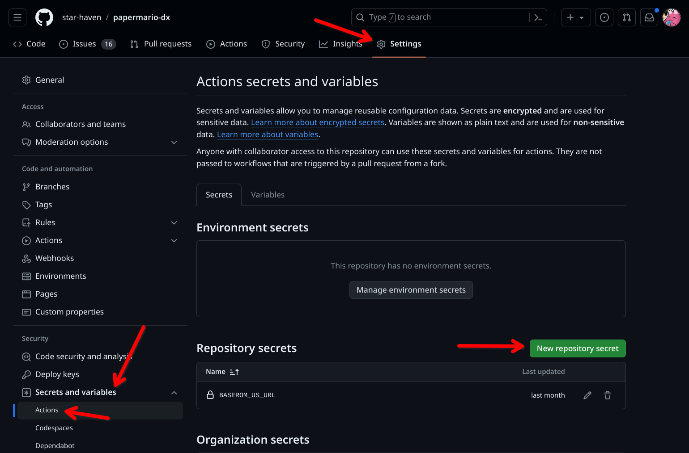

# CI/CD with GitHub Actions

If you fork DX, you can set a secret in your fork to enable CI/CD (Continuous Integration/Continuous Deployment) with GitHub Actions. This will automatically:

- Build your mod when you push to your fork, and upload the build to a release called `latest`.
- Build and publish a release of your mod when you push a new tag to your fork.
- Complain if a commit breaks the build.

## Setting up CI/CD



In your fork, go to the 'Actions secrets and variables' page.

Click the **New repository secret** button.

Add a new secret with the name `BASEROM_US_URL`.

The value will be the URL to a clean Paper Mario (U) ROM. This should be a private URL, such as one on your Google Drive.

To convert a Google Drive link to a direct download link, replace `XXXXXXXX` with the file ID in the following URL:

```
https://drive.usercontent.google.com/download?id=XXXXXXXX&export=download&confirm=y
```

Save this secret and you're done!

<div class="section_buttons">

| Previous                       |
|:-------------------------------|
|[Debugging](manual/gdb.md)      |

</div>
