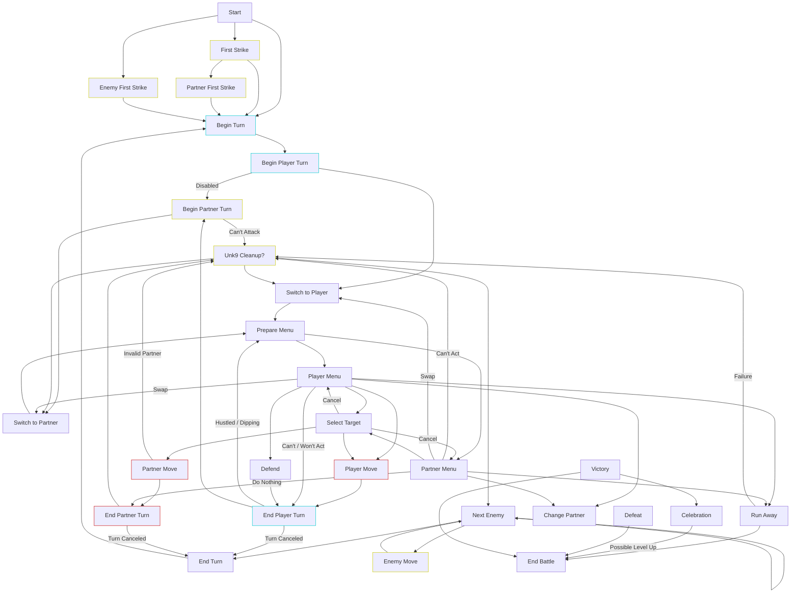

## Battle States

```mermaid
flowchart TD
    classDef maybe_win stroke:#00cccc
    classDef maybe_lose stroke:#cc1111
    classDef maybe_either stroke:#cccc00

    NormalStart[Start]
    FS_Player[First Strike]
    FS_Partner[Partner First Strike]
    FS_Enemy[Enemy First Strike]
    BeginTurn[Begin Turn]
    EndTurn[End Turn]
    BeginPlayer[Begin Player Turn]
    BeginPartner[Begin Partner Turn]
    Unk9[Unk9 Cleanup?]
    SwitchPlayer[Switch to Player]
    SwitchPartner[Switch to Partner]
    PrepareMenu[Prepare Menu]
    PlayerMenu[Player Menu]
    PartnerMenu[Partner Menu]
    %% PeachMenu[Peach Menu]
    %% TwinkMenu[Twink Menu]
    SelectTarget[Select Target]
    PlayerMove[Player Move]
    PartnerMove[Partner Move]
    NextEnemy[Next Enemy]
    EnemyMove[Enemy Move]
    EndPlayer[End Player Turn]
    EndPartner[End Partner Turn]
    RunAway[Run Away]
    Defend[Defend]
    Victory[Victory]
    Defeat[Defeat]
    ChangePartner[Change Partner]
    EndBattle[End Battle]
    %% EndDemo[End Demo]
    %% EndTraining[End Training]
    Celebration[Celebration]

    class FS_Player maybe_either
    class FS_Partner maybe_either
    class FS_Enemy maybe_either
    class PlayerMove maybe_lose
    class PartnerMove maybe_lose
    class EnemyMove maybe_either

    class BeginTurn maybe_win
    class BeginPlayer maybe_win
    class BeginPartner maybe_either
    class EndPlayer maybe_win
    class EndPartner maybe_lose
    class Unk9 maybe_either

    NormalStart --> BeginTurn
    NormalStart --> FS_Enemy
    NormalStart --> FS_Player
    FS_Player --> FS_Partner
    FS_Player --> BeginTurn
    FS_Partner --> BeginTurn
    FS_Enemy --> BeginTurn

    BeginTurn --> BeginPlayer
    %% BeginTurn --> |Debug Option| RunAway

    NextEnemy --> NextEnemy
    NextEnemy --> EnemyMove
    NextEnemy --> EndTurn
    EnemyMove --> NextEnemy

    BeginPlayer --> |Disabled| BeginPartner
    BeginPlayer --> SwitchPlayer

    PlayerMove --> EndPlayer

    EndPlayer --> |Turn Canceled| EndTurn
    EndPlayer --> |Hustled / Dipping| PrepareMenu
    EndPlayer --> BeginPartner
    %% EndPlayer --> |PEACH| Unk9

    BeginPartner --> |Can't Attack| Unk9
    BeginPartner --> SwitchPartner

    PartnerMove --> |Invalid Partner| Unk9
    PartnerMove --> EndPartner

    EndPartner --> Unk9
    EndPartner -->|Turn Canceled| EndTurn

    Unk9 --> SwitchPlayer
    Unk9 --> SwitchPartner
    Unk9 --> NextEnemy

    SwitchPlayer --> PrepareMenu
    SwitchPartner --> PrepareMenu

    PrepareMenu --> PlayerMenu
    PrepareMenu --> PartnerMenu

    %% BeginPlayer --> |PEACH| BeginPartner
    %% BeginPartner --> |PEACH| BeginPlayer
    %% PlayerMenu --> |PEACH| PeachMenu
    %% PartnerMenu --> |PEACH| TwinkMenu

    PlayerMenu --> |Can't / Won't Act| EndPlayer
    PlayerMenu --> |Swap| SwitchPartner
    PlayerMenu --> PlayerMove
    PlayerMenu --> SelectTarget
    PlayerMenu --> ChangePartner
    PlayerMenu --> RunAway
    PlayerMenu --> Defend

    PartnerMenu --> |Can't Act| Unk9
    PartnerMenu --> |Swap| SwitchPlayer
    PartnerMenu --> SelectTarget
    PartnerMenu --> ChangePartner
    PartnerMenu --> |Do Nothing| EndPartner
    PartnerMenu --> RunAway

    %% PeachMenu --> SelectTarget
    %% TwinkMenu --> SelectTarget
    %% TwinkMenu --> |Can't Act| EndPlayer

    SelectTarget -->  PlayerMove
    SelectTarget -->  PartnerMove
    SelectTarget -->  |Cancel| PlayerMenu
    SelectTarget -->  |Cancel| PartnerMenu

    EndTurn --> BeginTurn

    RunAway --> EndBattle
    RunAway --> |Failure| Unk9
    %% EndTraining --> EndBattle
    Celebration --> |Possible Level Up| EndBattle
    Defeat --> EndBattle
    Defend --> EndPlayer

    Victory --> EndBattle
    Victory --> Celebration

```
