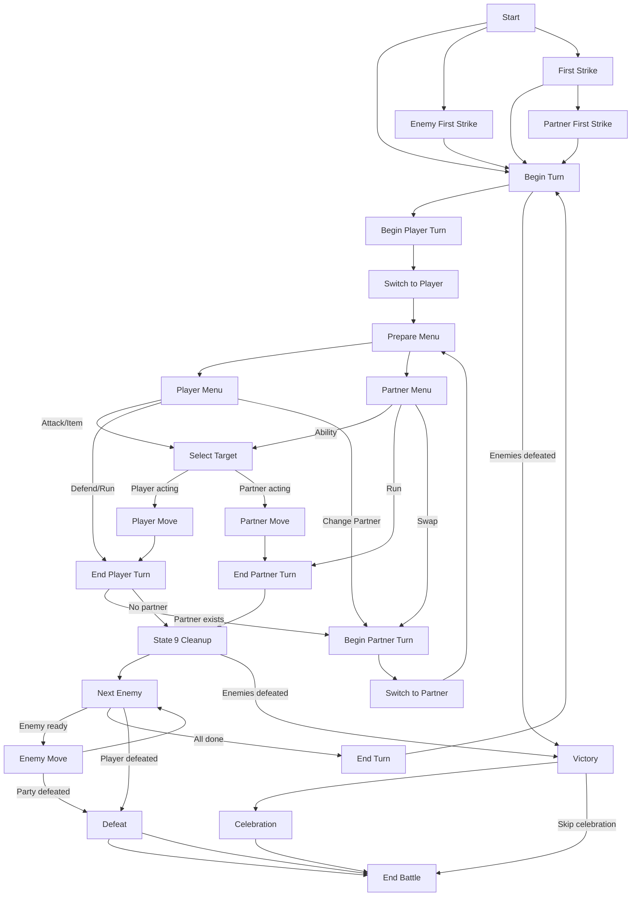

## Battle States

```mermaid
flowchart TD
    Start[Start]
    FS_Player[First Strike]
    FS_Partner[Partner First Strike]
    FS_Enemy[Enemy First Strike]
    BeginTurn[Begin Turn]
    BeginPlayer[Begin Player Turn]
    SwitchPlayer[Switch to Player]
    PrepareMenu[Prepare Menu]
    PlayerMenu[Player Menu]
    SelectTarget[Select Target]
    PlayerMove[Player Move]
    EndPlayer[End Player Turn]
    BeginPartner[Begin Partner Turn]
    SwitchPartner[Switch to Partner]
    PartnerMenu[Partner Menu]
    PartnerMove[Partner Move]
    EndPartner[End Partner Turn]
    Cleanup[State 9 Cleanup]
    NextEnemy[Next Enemy]
    EnemyMove[Enemy Move]
    EndTurn[End Turn]
    Victory[Victory]
    Defeat[Defeat]
    Celebration[Celebration]
    EndBattle[End Battle]

    Start --> BeginTurn
    Start --> FS_Enemy --> BeginTurn
    Start --> FS_Player --> BeginTurn
    FS_Player --> FS_Partner --> BeginTurn

    BeginTurn --> BeginPlayer
    BeginPlayer --> SwitchPlayer
    SwitchPlayer --> PrepareMenu
    PrepareMenu --> PlayerMenu
    PlayerMenu -->|Attack/Item| SelectTarget
    PlayerMenu -->|Defend/Run| EndPlayer
    PlayerMenu -->|Change Partner| BeginPartner

    SelectTarget -->|Player acting| PlayerMove --> EndPlayer
    SelectTarget -->|Partner acting| PartnerMove --> EndPartner

    EndPlayer -->|Partner exists| BeginPartner
    EndPlayer -->|No partner| Cleanup
    BeginPartner --> SwitchPartner --> PrepareMenu --> PartnerMenu
    PartnerMenu -->|Ability| SelectTarget
    PartnerMenu -->|Run| EndPartner
    PartnerMenu -->|Swap| BeginPartner
    EndPartner --> Cleanup

    Cleanup --> NextEnemy
    NextEnemy -->|Enemy ready| EnemyMove --> NextEnemy
    NextEnemy -->|All done| EndTurn --> BeginTurn

    NextEnemy -->|Player defeated| Defeat --> EndBattle
    EnemyMove -->|Party defeated| Defeat --> EndBattle
    BeginTurn -->|Enemies defeated| Victory
    Cleanup -->|Enemies defeated| Victory
    Victory --> Celebration --> EndBattle
    Victory -->|Skip celebration| EndBattle
```
