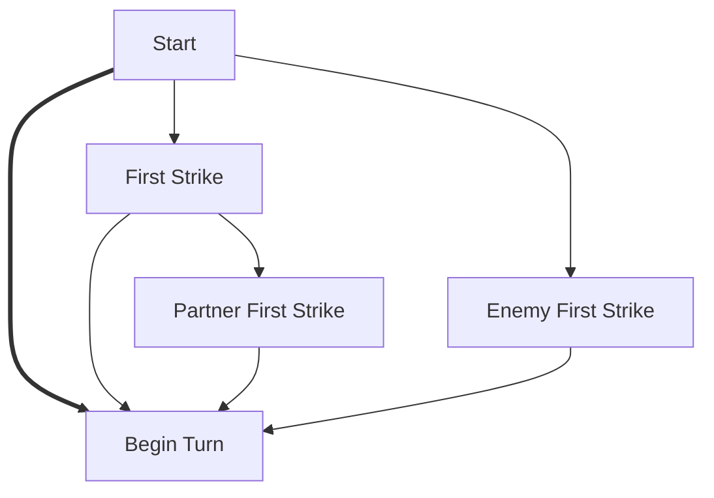
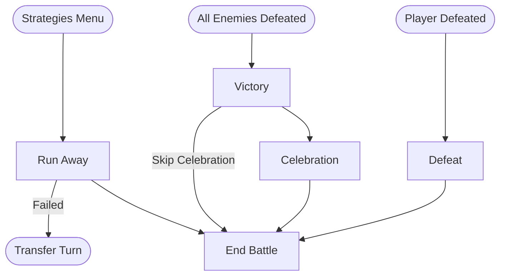
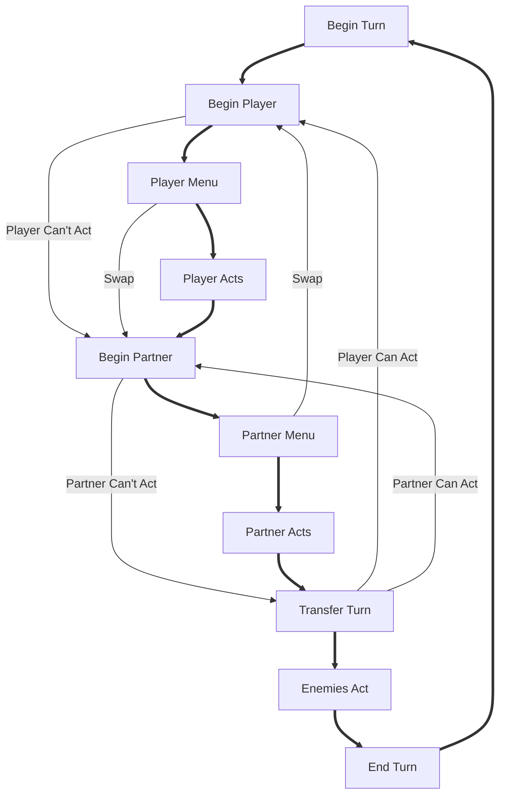
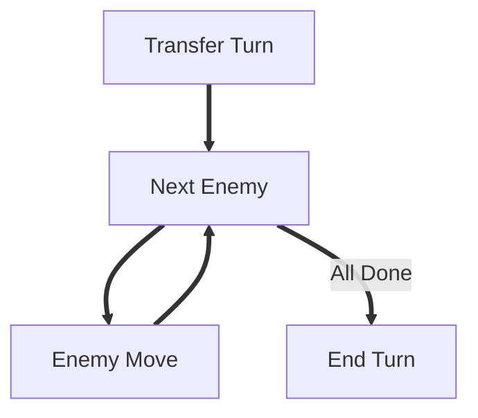
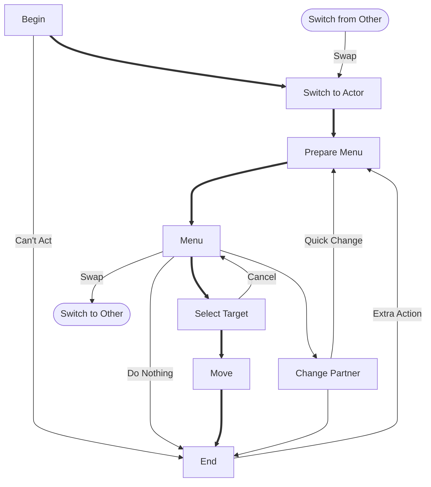
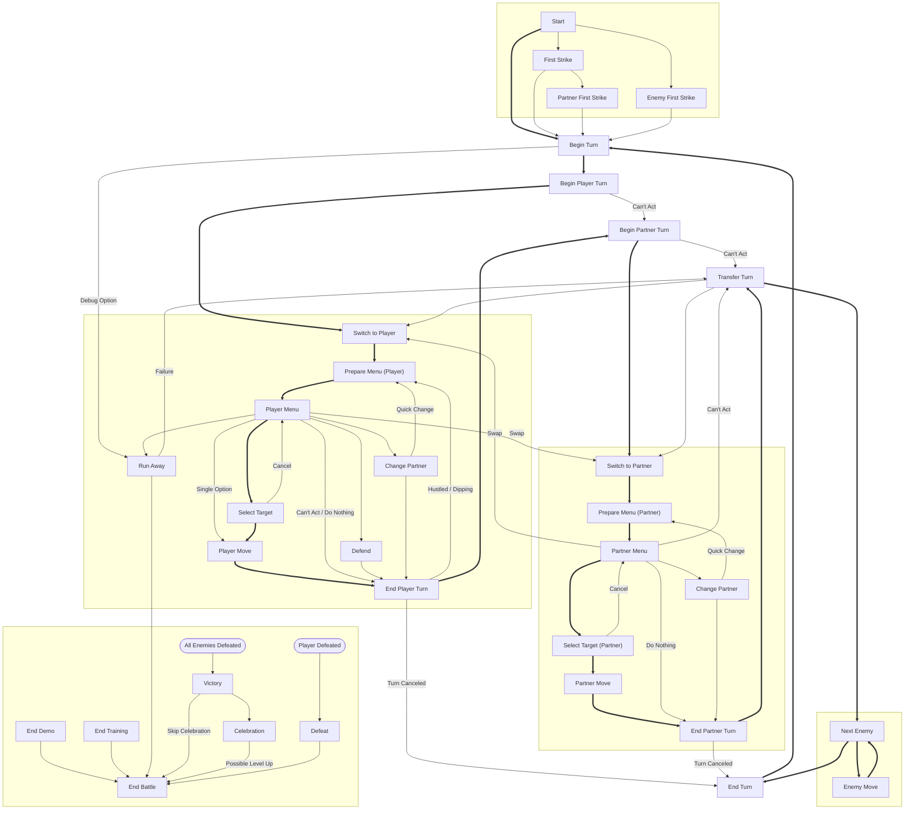

# Battle States

This document describes the battle state machine using a series of flowcharts.
Each node represents a state, and arrows represent transitions.
Bold arrows highlight the typical or most common transition paths.
The full state machine will be presented at the end, after we build up the major components.

## Initiating Battles

All battles begin in `BATTLE_STATE_START`, set during `load_battle_section`. After all actors are created,
this state checks whether the battle was initiated with a 'first strike' and selects the appropriate opening state.
Unless the battle ends with the first strike, the battle loop will begin with the first visit to `BATTLE_STATE_BEGIN_TURN`.

## Ending Battles

Battles are ended in `BATTLE_STATE_END_BATTLE` where the game mode is changed.

A battle ends when one of the following conditions is met:
1. The player is defeated (Defeat)
2. All enemies are defeated (Victory)
3. Run Away is successful (Flee)

The first two conditions are checked at certain points during multiple battle states; typically when an actor begins or
their turn, finishes using a move, or when control is being transfered to another actor. A full table of which states
may trigger which ending is presented here:

| State | Checks Victory | Checks Defeat |
|-------|:--------------:|:--------------:|
| FIRST_STRIKE               | X | X |
| PARTNER_FIRST_STRIKE       | X | X |
| ENEMY_FIRST_STRIKE         | X | X |
| BEGIN_TURN                 | X |   |
| BEGIN_PLAYER_TURN          | X | X |
| BEGIN_PARTNER_TURN         | X | X |
| PLAYER_MOVE                |   | X |
| PARTNER_MOVE               |   | X |
| END_PLAYER_TURN            | X |   |
| END_PARTNER_TURN           | X |   |
| TRANSFER_TURN              | X | X |
| ENEMY_MOVE                 | X | X |

Defeat is detected via `btl_check_player_defeated`, which initiates a transition to `BATTLE_STATE_DEFEAT` when
the player has zero HP.

Victory is detected via `btl_check_enemies_defeated`, which initiates a transition to `BATTLE_STATE_VICTORY` when
no valid defeatable enemies are left.

Some battles are scripted to end when certain conditions are met (see final_bowser_1 in kpa2).
This is done by setting `ACTOR_FLAG_NO_DMG_APPLY` to the boss actor and then setting `BS_FLAGS1_BATTLE_FLED`.
This counts as the enemy fleeing. On the next victory check, `btl_check_enemies_defeated` will find no enemies
left and trigger a Victory.

## Basic Turn Loop

Each turn has phases where the player may act, the partner may act, and the enemies act. If the player or partner
cannot act, their phase is skipped. They can also change the order in which their actions occur via swap. After the
partner acts, the `BATTLE_STATE_TRANSFER_TURN` state is used to select the next actor. This allows a player to go
after the partner and supports the swapped positions in a Peach battle.

**Note:** the nodes in this chart are simplified pseudo-states which do not correspond to literal battle states.
We'll go over the full state machine in a coming section.

## Enemy Actors

Each turn ends with the Enemy phase, where each enemy actor has an opportunity to act. Since their actions are
determined by their move scripts, this portion of the battle state machine is very simple. An enemy is selected
in `BATTLE_STATE_NEXT_ENEMY` and takes their turn with `BATTLE_STATE_ENEMY_MOVE`. This is repeated until all
enemies have acted, and then the turn ends.

## Player and Partner Actors

Player and partner actors both perform actions during the first part of each turn. Since the player controls these
actors, their state machines are much more complicated than the enemies'.
Both use roughly the following states:

## Full State Machine

This chart combines all the components we've introduced.
The full turn loop is evident as the state machine loops through `BATTLE_STATE_BEGIN_TURN` from `BATTLE_STATE_END_TURN`
once per turn.

Note: this chart leaves out edges pertaining to Peach battles, which have their own menu states, exchange BeginPlayer
and BeginPartner, and route through TransferTurn after player actions (as partner actions usually do).

